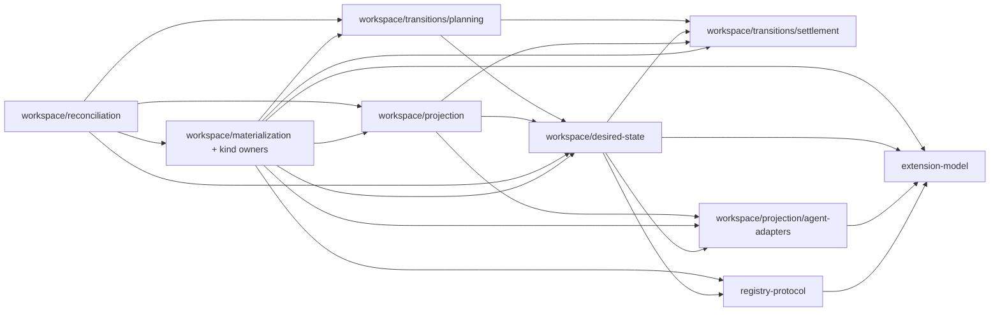

# Package architecture

The command and workspace architecture define what AXM does. This document
defines where that behaviour lives: which package owns each capability, what it
may depend on, and what a reader can rely on across a package boundary. The
executable specifications reached through the
[specification catalog](../../specifications/catalog.md) remain the sole local
requirements authority; nothing here creates an obligation.

Every package name states the capability it owns. Large user-facing
capabilities are vertical feature packages. Reusable state, mechanics, policy,
and integrations sit behind narrower inward-facing boundaries. `axm.sh` is the
composition and interaction boundary and owns no reusable business policy.

## Package and publication boundaries

A package is a source/compiler boundary; its existence does not require an npm
publication. The fixed published cohort contains `axm.sh`,
`@agentxm/extension-model`, `@agentxm/registry-protocol`,
`@agentxm/extension-content`, and `@agentxm/specification-metadata`. The domain,
wire, portable-content, and specification contracts have consumers outside the
CLI. The CLI publishes its application/runtime entries and site assets.

Other runtime packages are private workspace dependencies. The canonical
cohort packer includes their compiled JavaScript, declarations, manifests, and
licenses under the CLI package's `node_modules`, using pnpm's native bundled
dependency format. External dependencies remain declared by the CLI, so its
internal modules resolve the same Effect and shared-contract instances. No
declaration or module-specifier rewriting is involved. The packer stages that
hoisted package outside the workspace; source development retains pnpm's
isolated linker. Native compilation continues to use the same source through
the existing Bun targets.

Use `axm:produce-release-cohort` to prepare deliverable packages and
`axm:verify-artifacts` to check them. Packing an individual workspace package
produces an input to composition, not a complete CLI distribution. Production
capability boundaries apply equally to published and bundled modules, including
the distinct self-update and official-skill compatibility owners.

## Two classifications

Each package carries two orthogonal classifications, and both constrain what it
may import. The
[package classification and dependency policy](decisions/package-classification-and-dependency-policy.md)
record owns the choice and its rationale.

**Strategic domain** answers how distinctive the capability is, and comes from
placement. `packages/core/` holds the extension-management model AXM exists to
own. `packages/supporting/` holds necessary but undifferentiated adaptation to
external systems and native agent surfaces. `packages/generic/` is reserved for
broadly shared problems an adopted solution would serve better, and is empty.
Nothing authors a `domain:*` tag: `scripts/placement-tags-plugin.ts` derives it
from the path and rejects a project that authors one or sits outside a tier.

**Technical role** answers which direction a dependency may point, and is
authored in each `project.json`:

| Role               | What it is                                                                         |
| ------------------ | ---------------------------------------------------------------------------------- |
| `role:contract`    | Wire and model shapes shared across repository boundaries; no behaviour of its own |
| `role:integration` | Isolates change driven by an external system or a native agent surface             |
| `role:capability`  | Reusable mechanics or policy that several features build on                        |
| `role:feature`     | One complete reusable use case, end to end                                         |
| `role:application` | Parsing, interaction, rendering, process behaviour, and Layer composition          |
| `role:tooling`     | Engineering support under `tools/`, barred from runtime                            |
| `role:e2e`         | Observes shipped artifacts and entry points                                        |

The two are independent on purpose. `registry-client` is an integration and
strategically undifferentiated; `workspace/transitions/settlement` is a
low-level capability and among the most distinctive code in the repository.

## Core packages

`packages/core/` contains the `domain:core` packages in the fixed `release:cli`
cohort.

### Contracts

| Package                      | Role            | Owns                                                                                                                                                 |
| ---------------------------- | --------------- | ---------------------------------------------------------------------------------------------------------------------------------------------------- |
| `@agentxm/extension-model`   | `role:contract` | Platform-neutral extension identities, handles, FQNs, extension types, manifests, version constraints, package identities, and agent capability data |
| `@agentxm/registry-protocol` | `role:contract` | Registry wire contracts — index, discovery, publication set, visibility, authorization — and the suggested-action error vocabulary                   |

These two cross the repository boundary: the AgentXM Registry imports them and
the platform repository adopts them as its shared kernel. Both keep their
`./unstable/*` subpath exports, which are the cross-repository seam and are
named exactly in the dependency rules rather than covered by a tier. A contract
package acquires no filesystem, terminal, workspace, or transport behaviour,
and the model's external dependency budget is fixed at `effect`,
`packageurl-js`, `semver`, and `spdx-expression-parse`.

The extension model also owns shared exact/range/yank release selection in
`unstable/version-constraints/version-selection`. Its candidate contract contains
only the version and yank facts the algorithm needs; the selected candidate
retains consumer metadata. Registry serialization remains in the protocol, and
CLI release-age admission remains in extension resolution.

Pack dependency admission and prospective version resolution belong to the
model's `unstable/packs/dependency-policy` capability. Extension snapshots carry
shared facts; each pack retains its own requested constraints. The policy
evaluates admission and resolution together and returns only disclosable domain
facts. Registry protocol code owns wire encoding and recovery-command wording;
publication workflows retain their authorization and commit decisions.

Agent identity lives in `unstable/agent-capabilities/identity`, independently of
catalog data. Agent schemas and extension types can use identities without
importing the catalog whose entries those schemas describe. Catalog records are
checked for complete identity membership by TypeScript.

The model is the first scope of the intra-package policy gate in
[`tools/architecture/config.mjs`](../../tools/architecture/config.mjs). Its
native JS Boundaries descriptors classify the model as a core backstage domain
capability, and its export map declares public entry points. Domain files cannot
import filesystem, provider, or Node mechanisms. The source graph also rejects
file cycles across all production roles, including type-only edges, and
capability cycles between domain/application code. Adapter and composition
imports follow dependency inversion outside the frontstage/backstage constraint. The current Nx
rules remain in force elsewhere while capability ownership is separated; this
initial scope does not imply that the workspace packages already satisfy the
new policy/application/adapter separation.

The same gate also covers the supporting backstage `official-skill` capability
inside `@agentxm/cli-maintenance`. Its domain entry owns compatibility and
recovery rules, its application entry owns the injectable service contract, and
composition supplies the running CLI version. Core workspace consumers depend
on those public APIs; shared resolution no longer exports this consumer policy.
The capability's CLI adapter maps recovery actions and version targets to command
strings and the CLI document schema. The domain neither imports that adapter nor
constructs commands.
Candidate byte inspection and Registry orchestration remain in the existing
packages pending their application/adapter separation.

### Capabilities

| Package                      | Role              | Owns                                                                                                                                                                                                                                                                                                                                                                                                                              |
| ---------------------------- | ----------------- | --------------------------------------------------------------------------------------------------------------------------------------------------------------------------------------------------------------------------------------------------------------------------------------------------------------------------------------------------------------------------------------------------------------------------------- |
| `@agentxm/extension-content` | `role:capability` | Skill and subagent content parsing, Knowledge bundle inspection and search, the lint rule catalog, and archive and manifest validation                                                                                                                                                                                                                                                                                            |
| `@agentxm/workspace`         | `role:capability` | Desired and observed state; accepted resolution and source adapters; owned projection and native agent adapters; kind-specific acquisition and materialization for skills, subagents, MCP connections, instructions, hooks, Knowledge, and Packs; reconciliation planning; transition execution; and transaction settlement. Its public subpaths expose these cohesive capabilities without creating separate package identities. |

`extension-content` is a leaf. It reads the model and nothing else, which is
why integrations and supporting packages may consume it by name without pulling
workspace or transport packages behind it.

`workspace/transitions/settlement` owns the transition lock, transaction runner,
preimages, restoration, verification, and write registration. The closure API —
`withWorkspaceClosure`, `settleWorkspaceClosure`, `rollbackWorkspaceClosure`, and
`pendingClosureRestorations` — is consumed by transition planning alone. Every
other capability registers writes with `protectWorkspacePath` and runs
transactions with `runWorkspaceTransaction`.

`workspace/transitions/planning` owns the mechanics for safely applying a plan,
never the feature policy that decides which plan should exist. Every feature
that changes workspace state builds its own plan and applies it here; no feature
executes another feature's plans.

`workspace/reconciliation` sits above materialization, resolution, desired
state, projection, and transition planning. Lifecycle, sync, and authoring
invoke this capability as peer features. It owns the policy that joins
declarations, accepted content, and native outputs into a coherent transition. The
[shared reconciliation decision](decisions/shared-desired-state-reconciliation.md)
explains why that policy has its own module boundary.

`workspace/materialization` supplies the shared manager contract and dynamic
dispatch needed by reconciliation. The implementations live with their kind
owners under `skills`, `subagents`, `mcp-connections`, `instructions`, `hooks`,
`knowledge`, and `packs`. They keep platform, Registry transport, and native
write requirements explicit in `R`; desired-state and accepted-resolution
writes remain coordinated above the manager boundary.

`workspace/projection` owns what AXM claims in agent-facing output and what its
observed state means: the ownership units, who may contribute to each, the
provenance that proves a claim, and the facts lint and sync reconcile against.
It reaches the capabilities that materialize those units only through the
`ProjectionParticipants` registry they register with, so a fact never depends
on the module that writes the unit.

`workspace/projection/agent-adapters` owns installed-agent detection and the
native format mechanics used by projection: coding-agent adapters, subagent
rendering, MCP configuration, hook-group editing, ownership markers, and the
YAML, TOML, and JSON codecs used by those writers. Its inputs are plain data,
and native writes use the `NativeWriteAuthority` port so the enclosing workspace
transaction protects and records every target.

`workspace/resolution` decides acceptance, so it needs workspace facts, source
acquisition, and `extension-content`. It sits above desired state, never below
it. `workspace/resolution/sources` owns locator routing, host providers,
convention and manifest discovery, identifier resolution, and shallow Git
acquisition. Those adapters consume workspace policy only through the
`RegistryResolutionPolicy`, `AxmSkillCandidateGate`, and `WorkspaceCatalog`
ports bound at composition.

Self-update is strategically supporting. Its installation facts, platform
support, version comparison, reinstall policy, downgrade refusal, and automatic
upgrade eligibility belong to `cli-maintenance/self-update/domain`. The
frontstage self-update capability and backstage official-skill compatibility
capability share one package with separate enforced module boundaries.
Upgrade preparation belongs to its application, with installation-inspection
and release-catalog ports. It owns platform and ownership admission, release
selection, and the immutable candidate used for preview and application.
Stable-channel/GitHub access and CLI observation are separately composed
adapters. Startup checking also belongs to the application; its cache and
release-origin adapters supply facts without owning eligibility policy.

Native host adapters live in `self-update/adapters/native`, with concrete
Layers under `self-update/composition/native`. Their package, build, and release
boundary is CLI maintenance; source rules still separate domain, application,
adapters, and composition. The separate native-update package is removed.
The CLI owns progress observation, operation-lifecycle experience tests, and
selection of the user's cache path. Native fixtures can exercise installation
without those delivery services. This consolidation removes a package and Nx
project after moving their consumer-specific responsibilities to the CLI.

The application owns `UpgradeSettlement`: installation, availability, mutation,
verification, and recovery facts. The CLI adapter under
`self-update/adapters/cli` owns the `axm.upgrade-assessment/v1` document,
messages, plan steps, and command display. The CLI maps a settlement once at its
delivery boundary. Availability has one canonical value in the settlement, so
failure wording and the machine disposition read the same observation.

Package-managed upgrades use one application operation for availability,
mutation, verification, bounded Homebrew reinstall recovery, and installation
recording. `PackageInstaller` supplies protocol observations and command
evidence; `InstallationRecorder` persists an accepted installation. Domain
policy decides whether executable observations establish the selected version
and whether an unchanged Homebrew installation earns one recovery attempt.
The application can run without a terminal or native host services. An optional
execution observer adapts its stage lifetimes to CLI progress without selecting
the outcome. Each operation returns its evidence; callers do not share mutable
command arrays across deferred work.

Script upgrades also have an application-owned operation. Domain code selects
the checksum and accepts executable-version observations; the application owns
staging, protection, replacement, rollback, and installation-recording order.
`ScriptReleaseAssets` supplies downloaded bytes with their digest and checksum
manifest. `ScriptExecutableInstaller` supplies observations and scoped replacement
leases. The native lease owns the lock, temporary files, backup, and interruption
cleanup. A metadata failure preserves the verified new executable and its backup;
acceptance releases the backup. A failed verification after restoration identifies
the restored executable, rather than claiming the consumed backup still exists.

`cli-update` retains its current placement while native inspection and the
remaining preview/progress bindings are separated. Its installer adapters own
command grammar, process execution, response decoding, downloads, and filesystem
resources; composition selects those adapters and metadata storage. Package and
script execution can both run without host services, but the combined preview and
upgrade entry still selects native recovery guidance.
The remaining operation-vocabulary dependency does not make self-update
strategically core.

The lower-level graph is deliberately small:

### Feature modules

A feature module owns a complete reusable use case: the policy,
orchestration, typed failures, typed result, and the specifications that state
its promises. It depends on contracts, capabilities, and integrations through
their public service APIs, and never on another feature module.

| Module                                   | Role           | Use cases it owns                                                                                                                                        |
| ---------------------------------------- | -------------- | -------------------------------------------------------------------------------------------------------------------------------------------------------- |
| `@agentxm/workspace/reconciliation/sync` | `role:feature` | Scope selection, shared reconciliation invocation, convergence and reconciliation outcomes                                                               |
| `@agentxm/workspace/linting`             | `role:feature` | Workspace facts, lint rules, findings, normalization, and bounded fix planning                                                                           |
| `@agentxm/workspace/lifecycle`           | `role:feature` | Install, update, uninstall, enable, disable, demote, and Pack unpacking across root and type-specific forms                                              |
| `@agentxm/workspace/authoring`           | `role:feature` | New, fork, native import, adopt identity policy, version, and authored Pack membership                                                                   |
| `@agentxm/workspace/publishing`          | `role:feature` | Publish selection, publication validation, archive planning, authentication requirements, upload settlement, recovery, visibility, yank, and deprecation |
| `@agentxm/workspace/discovery`           | `role:feature` | Project package detectors, local extension declarations, Registry recommendations, and discovery results                                                 |
| `@agentxm/workspace/configuration`       | `role:feature` | Setup, configured-agent membership, instruction management, and inline workspace capabilities such as MCP servers                                        |
| `@agentxm/workspace/inspection`          | `role:feature` | List, view, show, Pack inventory, and version-currency queries                                                                                           |
| `@agentxm/workspace/knowledge/query`     | `role:feature` | Knowledge concept resolution, retrieval, search, related concepts, and status                                                                            |

Each exposes an application API of the shape `prepare(request) → Candidate` and
`previewOrApply(candidate, execution) → OperationResolution`, with typed
failures in `E` and service requirements in `R`. Preview, confirmation,
structured output, and application all refer to the same prepared candidate.
Features take no CLI-supplied callbacks; the legitimate interaction ports they
declare — resolving a plan, observing an interruption signal, workspace
initialization, and the authentication presenters — are typed services the
application binds.

The workspace linting module does not absorb contract-level validation used by
publication and Registry ingestion; that lives with `extension-content` and
`registry-protocol`. It composes facts and findings about installed and
authored workspace state.

## Supporting packages

`packages/supporting/` — `domain:supporting`. They may reach
only each other, `packages/generic/`, and the three named seams
`extension-model`, `registry-protocol`, and `extension-content`. Nothing else
under `packages/core/` is reachable from a supporting package, which is what
keeps the distinctive model from leaking outward through an adapter.

| Package                    | Role               | Owns                                                                                                                                                                         |
| -------------------------- | ------------------ | ---------------------------------------------------------------------------------------------------------------------------------------------------------------------------- |
| `@agentxm/registry-client` | `role:integration` | Local and remote Registry clients over the generated OpenAPI transport, request policy and retries, typed Registry failures, the archive cache, and lifecycle administration |
| `@agentxm/registry-auth`   | `role:capability`  | Login, logout, token and identity inspection, device and loopback flows, step-up authorization, and credential lifecycle                                                     |
| `@agentxm/cli-maintenance` | `role:capability`  | Self-update decisions and official-skill compatibility, with independent capability visibility and architectural-role constraints inside the package                         |

`registry-auth` is a capability rather than a feature because publish,
authoring, and visibility consume it; its own command surface is a thin use of
the same services.

## Engineering libraries

`tools/` — engineering support. No `domain:*` tag, `role:tooling`, and barred
from every runtime role's imports. Test-purpose files inside a runtime package
may compose them.

| Package                           | Owns                                                                                                                                                                                                             |
| --------------------------------- | ---------------------------------------------------------------------------------------------------------------------------------------------------------------------------------------------------------------- |
| `@agentxm/specification-metadata` | The executable-specification metadata contract shared across AgentXM repositories: specification, product-goal, execution-binding, and bound-evidence definitions, their decoders, and corpus conformance checks |
| `@agentxm/test-support`           | Shared deterministic test-world adapters                                                                                                                                                                         |
| `@agentxm/extension-type-parity`  | Extension-type parity obligations, the lifecycle contract and the exemption ledger the conformance suites read                                                                                                   |
| `@agentxm/client-e2e-utils`       | Shared end-to-end utilities (`tools/e2e-utils`)                                                                                                                                                                  |

`specification-metadata` ships with the release cohort so other repositories
author specifications against it. That does not make it a runtime contract: it
is engineering support, and the role matrix keeps it out of production source.

## Applications

`apps/cli` is `axm.sh` (`role:application`). It owns:

- command registration, arguments, and flags;
- interactive prompts and confirmation;
- human and machine rendering;
- mapping typed feature failures to `AppError`, exit codes, and output;
- telemetry and process lifetime; and
- final Effect Layer composition.

A command handler parses, calls a feature or capability application API, and
renders. It may invoke several APIs in sequence — a lifecycle mutation followed
by reconciliation — because fixed sequencing is application wiring. When the
sequence acquires decisions of its own, beyond error handling, that policy
belongs in a feature package. Machine-output document schemas live with the use
case that produces them; the CLI keeps envelope and exit-code mapping.

The CLI-local runtime envelope, error mapping, telemetry consent and
redaction, and telemetry transport stay in the application while the CLI is
their only sanctioned consumer. They earn a separate package only if a second
production application needs the same boundary.

`apps/cli-e2e` (`role:e2e`) observes the published CLI boundary — the built
binary, the filesystem, installers, and real transports — and never becomes a
production dependency. It may depend only on tooling libraries and contracts,
and product packages are banned from it by scope so it cannot reach past the
shipped artifact.

## Public package APIs

Every production package declares intentional `exports`. Its root exports the
public service contract, schemas, domain types, and pure behaviour that inward
consumers may use.

- `./live` carries environment-backed implementations. In production source
  only `apps/cli/src/runtime.ts` imports one; feature logic keeps service
  requirements in its Effect environment. A package's own tests may compose its
  `./live`, and a small enumerated set of fixtures composes a dependency's
  live layer where the fact under observation is the real workspace.
- `./testing` carries deterministic in-memory implementations of that
  package's own root services, with controlled clock, identifier, and
  filesystem defaults — and nothing else. Fixtures for other packages and
  assertion helpers stay with their consumers. Production source never imports
  `*/testing`; tests and specifications do.
- The two contract packages keep their `./unstable/*` subpaths, and
  `extension-content` additionally exports `./knowledge` and `./lint`.
- `axm.sh` exports `./app`, `./runtime`, and the generated site content. It
  publishes no test or harness entry point: specifications inherit the
  production boundary of the project that owns them and compose package-owned
  `./testing` ports, so there is nothing for a shared harness to be.

Deep imports into another package's `src`, `dist`, or undeclared subpaths are
forbidden. A needed cross-package symbol either belongs in the provider's
public API or reveals that the responsibility is in the wrong package. A broad
barrel is not added merely to make an import legal.

## Enforcement

The durable obligations are inward dependency direction, feature isolation,
acyclicity, public package APIs, and composition of concrete
implementations. The exact set of edges present at any moment is implementation
state derived by Nx, not a second normative graph to maintain.

### Project topology

Nx owns the production project graph. `@nx/enforce-module-boundaries` applies
the `type:*`, `role:*`, and `domain:*` matrices with circular-dependency checks
enabled and no ignored project pairs. Its configuration also enables:

- `enforceBuildableLibDependency`, so a buildable package cannot acquire a
  non-buildable production dependency;
- `banTransitiveDependencies`, so production code cannot silently import an
  undeclared transitive package; and
- `allowedExternalImports` for the extension model's fixed external budget.

General matrices own direction. A package-specific constraint is added only for
a stable asymmetric boundary the matrices cannot express — `registry-protocol`
on `extension-model` and the `extension-content` leaf. Every package carries a
`scope:*` identity tag for
selection; the prohibition is on using those tags in `depConstraints` to
rebuild an adjacency list, not on the tags existing.

The flat ESLint configuration applies the boundary rule to `.ts`, `.tsx`,
`.mts`, `.cts`, `.js`, `.jsx`, `.mjs`, and `.cjs`. A parallel relaxed
constraint set applies to test-purpose files, which may compose the engineering
libraries under `tools/` and are exempt from the buildability rule.

### Manifest fidelity

`@nx/dependency-checks` owns agreement between a buildable or publishable
package's build inputs and its `package.json`. Manifests are linted through
`jsonc-eslint-parser` with missing, obsolete, and version-mismatch checks
enabled. Together with module boundaries this rejects an imported edge that
violates its policy, a production import missing from the owning manifest, an
obsolete declared dependency, and an external import outside a constrained
package's budget.

### Composition and handler boundaries

Nx tags cannot distinguish the CLI composition root from command handlers in
the same project, or a package root from its `./live` entry. Focused ESLint
`no-restricted-imports` overrides therefore:

- allow concrete `@agentxm/*/live` composition in the CLI runtime and each
  package's `./live` entry; feature source retains the owned services in its
  Effect requirements;
- reserve `@agentxm/*/testing` for the enumerated fixtures and tests;
- forbid handlers under `apps/cli/src/root/**` from constructing plans, calling
  workspace writers, or reaching transactions, sources, and the Registry client
  directly, while leaving contract types importable for rendering;
- restrict the transaction closure API to `workspace/transitions/planning`; and
- forbid imports through another package's `src`, `dist`, or other undeclared
  subpaths.

Where a meaningful internal direction remains inside one package, use the same
focused mechanism. A substantial independent boundary should normally become a
package so Nx can model it directly.

### Requirement and verification ownership

Structural policy is enforced natively and verified by ordinary tooling tests:
[`scripts/module-boundaries.test.ts`](../../scripts/module-boundaries.test.ts)
exercises real allowed and forbidden fixture imports through the flat
configuration rather than asserting on configuration strings, and
[`scripts/composition-root-lint-exceptions.test.ts`](../../scripts/composition-root-lint-exceptions.test.ts)
exercises allowed and forbidden composition and handler imports. ESLint
configuration owns the exception lists; tests do not duplicate their text. These are engineering
policy, not product requirements, and they do not appear in the specification
catalog.

Two structural obligations do have external standing and remain executable
specifications: `system/architecture/public-system-depends-only-on-published-contracts`
and `system/architecture/e2e-observes-only-shipped-artifacts`. A specification
whose decisive verification is a static gate declares literal-only
`boundEvidence` beside its metadata, and the catalog lists the gate beside the
requirement; bound evidence supports an owning specification and never replaces
one.

### No additional complementary tools

The package boundaries give Nx sufficient granularity and the remaining
composition exceptions fit ordinary ESLint configuration. Do not add
dependency-cruiser, adopt Knip as an architecture gate, or adopt Nx Enterprise
Conformance for a TypeScript-only graph. Reconsider only after evidence shows a
boundary Nx and focused ESLint rules cannot express — numerous durable
folder-level constraints, or production dependencies in languages ESLint cannot
inspect.

## Nx workspace conventions

Nx owns task discovery, dependency ordering, caching, affected selection, and
project-boundary enforcement. Repository scripts own AXM-specific workflows.
The [repository task interface](../guides/repository-task-interface.md) binds
the task semantics; this section covers what package placement implies.

### Targets are inferred, not authored

- `@nx/eslint/plugin` infers `lint` for every project the root flat
  configuration covers.
- `@nx/vitest` infers `test` from `{apps/cli,packages/**,tools/**}/vitest.config.ts`.
  A separately scoped instance maps `apps/cli-e2e/vitest.config.ts` to
  `e2e-main`. Windows, compiled-binary, artifact, and installation suites stay
  explicit because they carry distinct dependencies, environment, or config.
- `scripts/typecheck-plugin.ts` infers `typecheck` from
  `{apps/*,packages/*/*,tools/*}/tsconfig.spec.json`, checking each project's
  tests against the built library without sharing build outputs.
- `scripts/placement-tags-plugin.ts` contributes `domain:*` from the same
  placement shape.
- `@nx/js/typescript` is registered for project-reference synchronization only,
  with `typecheck` and `build` disabled. AXM's explicit `@nx/js:tsc` builds are
  intentional while the
  [dual TypeScript toolchain](decisions/typescript-dual-alias.md) requires the
  in-process TypeScript 6 compiler for published artifacts.

Each project keeps a solution `tsconfig.json` that references
`tsconfig.lib.json` and `tsconfig.spec.json`; the two bases differ in their
Effect language-service diagnostic severities. `nx sync:check` detects
reference drift.

Common executor behaviour lives in `targetDefaults`, so a project file states
only entry points, output exceptions, generation dependencies, and genuinely
local behaviour. When a project adds to an inherited array, use Nx's `...`
spread token rather than copying the default and letting it drift. Aggregate
targets whose only job is to depend on other targets use `nx:noop`.

### Release membership is declarative

Every publishable package in the CLI product carries `release:cli`, and the
release set is selected with `"projects": ["tag:release:cli"]`. Release
workflows use the same matcher rather than a second project list.
`projectsRelationship: "fixed"` and version plans stay while these unstable
packages ship as one product. Another release group is created only when a
package gains a genuinely independent lifecycle. Keep `nx` and all `@nx/*`
packages on one version.

### Creating a package

Use `@nx/js:library` with the workspace defaults: the `tsc` bundler, ESLint,
Vitest in the Node environment, strict TypeScript, `project.json`
configuration, and buildable and publishable setup. Place it under
`packages/<tier>/<name>` so the plugin infers its `domain:*` tag — authoring
one is an error — and supply its `role:*`, `scope:*`, and `release:cli` tags.
Its `test`, `lint`, and `typecheck` targets follow from placement. Do not build
a custom generator until repeated AXM-specific edits remain after the official
generator and workspace defaults are in place.

### Domain workflows stay custom

Custom targets remain appropriate where they implement AXM-specific work rather
than invoke a tool: Registry and telemetry contract synchronization and client
generation; extension-type matrices, CLI help, schemas, and bundled-skill
generation; cross-platform compilation and artifact verification; release
metadata, checksums, assets, GitHub, and Homebrew workflows; CI change
classification and container workflows; Allure report orchestration; and
specification selection, catalog generation, and verdict rendering.

Nx Cloud remote caching, Nx Agents, the Vitest Atomizer, and task sandboxing
are later optimizations, adopted only after measuring a CI or isolation
problem.

## Nx references

- [Enforce module boundaries](https://nx.dev/docs/features/enforce-module-boundaries)
- [Enforce module boundaries rule](https://nx.dev/docs/kb/enforce-module-boundaries)
- [External import constraints](https://nx.dev/docs/guides/enforce-module-boundaries/ban-external-imports)
- [Dependency checks](https://nx.dev/docs/kb/dependency-checks)
- [Nx with ESLint](https://nx.dev/docs/technologies/eslint/introduction)
- [Nx with Vitest](https://nx.dev/docs/technologies/test-tools/vitest/introduction)
- [Nx with TypeScript](https://nx.dev/docs/technologies/typescript/introduction)
- [`nx.json` reference](https://nx.dev/docs/reference/nx-json)
- [`@nx/js:library` generator](https://nx.dev/docs/technologies/typescript/generators)
- [Release groups](https://nx.dev/docs/guides/nx-release/release-groups)
