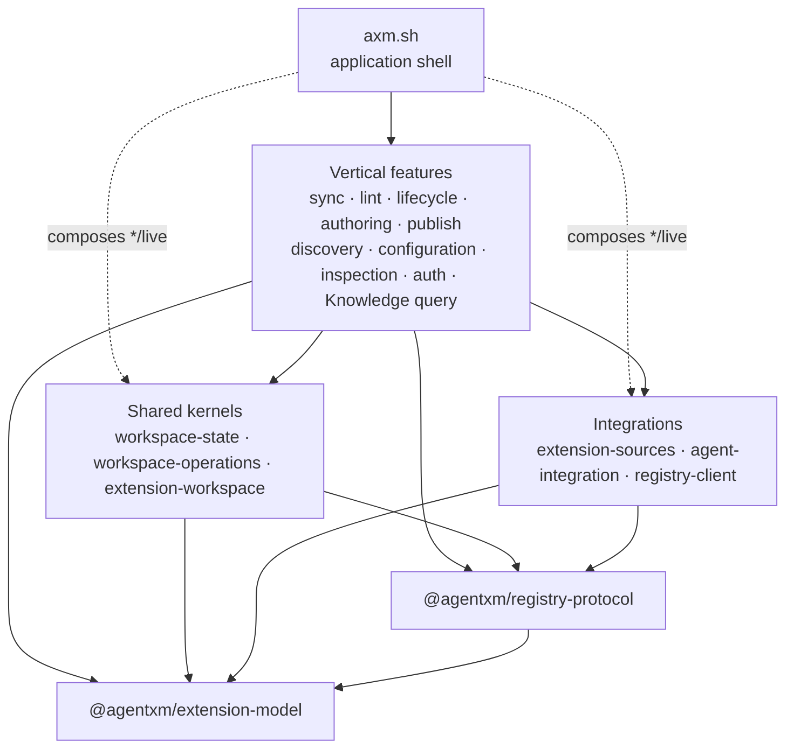
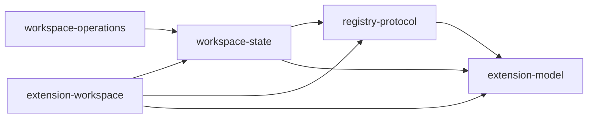

# Package architecture

This document explains the target implementation structure for decomposing
`@agentxm/extension-management`. The command and workspace architecture define
what AXM does; this package architecture defines where reusable implementation
responsibilities live and which dependencies are permitted between them. The
executable specifications in the
[specification catalog](../../specifications/catalog.md) remain the sole local
requirements authority.

## Purpose

The refactor exists to make the code structure express the product structure.
`@agentxm/extension-management` currently groups workspace state, mutation
mechanics, extension semantics, external integrations, and complete CLI use
cases behind one package boundary. Those responsibilities change for different
reasons, and the broad boundary allows unrelated code to depend on one another
without making that coupling visible.

The target architecture replaces that grab bag with cohesive packages whose
names state the capability they own. Large user-facing capabilities such as
sync and lint become vertical feature packages. Reusable state, operation
mechanics, and integrations sit behind narrower inward-facing boundaries. The
CLI remains the composition and interaction boundary.

## Desired outcomes

The refactor is successful when it produces all of these outcomes:

- **Cohesive ownership.** Each package has one recognizable reason to change
  and owns a complete capability, shared kernel, integration, or contract.
- **Explicit, minimal coupling.** Dependencies point inward through declared
  public APIs. A feature imports only the lower-level capabilities it uses.
- **Independent workspace boundaries.** Workspace state, operation mechanics,
  and extension-specific workspace semantics are separate packages rather than
  internal folders inside another broad workspace package.
- **Vertical feature slices.** Sync, lint, lifecycle, authoring, publishing,
  discovery, configuration, inspection, authentication, and Knowledge queries
  each own their end-to-end application policy without depending on another
  feature package.
- **A thin application shell.** `axm.sh` owns parsing, prompts, presentation,
  process behavior, and Effect Layer composition; it does not own reusable
  business policy.
- **Enforceable architecture.** Nx tags and lint rules reject invalid layer
  dependencies, package manifests and exports reject undeclared or deep access,
  and an executable architecture specification owns the exact permitted graph.
- **Low-cost package growth.** New packages inherit conventional build, lint,
  test, typecheck, cache, and release behavior with little per-project
  configuration.
- **Clean pre-launch breaks.** Each extraction updates the canonical package
  boundary and every producer, consumer, test, generated input, and document in
  the same change. The existing package does not survive as a compatibility
  façade, shim, alias, dual export, or deprecated import path.

These outcomes favor separation of responsibilities over a small package
count. Package count is not itself a goal: a package earns its boundary when it
has a distinct responsibility, public API, dependency budget, and focused
verification.

## Non-goals

This refactor does not:

- change the user-visible command model or workspace authority model;
- preserve compatibility for internal package names, import paths, exports, or
  intermediate layouts superseded by the target structure;
- create generic `core`, `common`, `shared`, or `utils` packages;
- require every small command to become a feature package before its behavior
  warrants one;
- make the packages independently versioned while they ship as one CLI product;
  or
- require Nx Cloud, Nx Agents, Enterprise Conformance, or test atomization to
  enforce the TypeScript package graph.

## Target structure

The architecture has five layers. Dependencies point downward and never back
toward the application. Feature packages are peers: shared behavior moves to an
inward package instead of creating feature-to-feature dependencies.



The dotted application edges are composition-only. Command handlers invoke
feature APIs; they do not bypass a feature and implement its use case directly
against a kernel or integration.

### Contracts

The existing shared contracts remain the innermost packages.

| Package                      | Responsibility                                                                                                  | Permitted product dependencies |
| ---------------------------- | --------------------------------------------------------------------------------------------------------------- | ------------------------------ |
| `@agentxm/extension-model`   | Platform-neutral extension identity, types, manifests, constraints, package identity, and agent capability data | None                           |
| `@agentxm/registry-protocol` | Registry wire contracts, protocol error vocabulary, content parsing, and contract-level publication validation  | `@agentxm/extension-model`     |

The extension model keeps its explicit dependency budget. A contract package
does not acquire filesystem, terminal, workspace, or transport behavior.

### Shared kernels

Workspace management is divided into distinct packages rather than recreated
as internal modules under a new umbrella.

| Package                         | Responsibility                                                                                                |
| ------------------------------- | ------------------------------------------------------------------------------------------------------------- |
| `@agentxm/workspace-state`      | Settings, lockfile, desired and observed state, authority, repositories, and snapshots                        |
| `@agentxm/workspace-operations` | Plans, semantic mutation closures, outcomes, transactions, journals, rollback, and safe application mechanics |
| `@agentxm/extension-workspace`  | Extension-type workspace semantics, canonical content, contributor calculation, and projection contributions  |

The exact lower-level graph is deliberately small:



`workspace-operations` is generic only within the AXM workspace model. It owns
the mechanics for safely applying a plan, but not the feature policy that
decides which plan should exist. `extension-workspace` owns the extension-type
knowledge required to derive canonical and projected state; it does not own a
complete lifecycle or sync workflow.

### Integrations

Integration packages isolate change driven by external systems and native
agent surfaces.

| Package                      | Responsibility                                                                                     | Expected inward dependencies          |
| ---------------------------- | -------------------------------------------------------------------------------------------------- | ------------------------------------- |
| `@agentxm/extension-sources` | Source syntax, source resolution, probing, and acquisition across Registry, Git, and local sources | Registry client and contracts         |
| `@agentxm/agent-integration` | Agent detection and adapters for native agent capability surfaces                                  | Extension model                       |
| `@agentxm/registry-client`   | Registry transport, caching, OAuth transport primitives, and generated client integration          | Registry protocol and extension model |

`@agentxm/extension-sources` may depend on `@agentxm/registry-client`; other
integration packages do not depend on features or the CLI. Integrations expose
typed services at their package root and concrete environment-backed Layers
through explicit `./live` exports.

### Vertical features

A vertical feature package owns a complete reusable use case. It contains the
policy, orchestration, typed failures, typed result, and focused tests needed by
the CLI and other sanctioned entry points. It depends on contracts, kernels,
and integrations through their public service APIs.

| Package                            | Use cases it owns                                                                                                   | Primary lower-level collaborators                                               |
| ---------------------------------- | ------------------------------------------------------------------------------------------------------------------- | ------------------------------------------------------------------------------- |
| `@agentxm/workspace-sync`          | Desired-state reconciliation, semantic closure planning and execution, projection realization, and closure outcomes | Workspace state and operations, extension workspace, sources, agent integration |
| `@agentxm/workspace-lint`          | Workspace facts, lint rules, findings, normalization, and bounded fix planning                                      | Workspace state and operations, extension workspace, agent integration          |
| `@agentxm/extension-lifecycle`     | Install, update, uninstall, enable, and disable across root and type-specific command forms                         | Workspace state and operations, extension workspace, sources, agent integration |
| `@agentxm/extension-authoring`     | New, fork, import, adopt, demote, version, and authored pack membership                                             | Workspace state and operations, extension workspace, contracts                  |
| `@agentxm/extension-publish`       | Publish selection, validation, authentication requirements, upload, settlement, and recovery                        | Workspace state, extension workspace, registry client, registry protocol        |
| `@agentxm/extension-discovery`     | Project detectors, local declarations, Registry recommendations, and discovery results                              | Workspace state, extension sources, registry client, extension model            |
| `@agentxm/workspace-configuration` | Setup, configured-agent membership, instruction management, and inline workspace capabilities such as MCP servers   | Workspace state and operations, extension workspace, agent integration          |
| `@agentxm/workspace-inspection`    | List, view, inventory, and version-currency queries                                                                 | Workspace state, extension workspace, sources, registry client                  |
| `@agentxm/registry-auth`           | Login, logout, token, identity inspection, device and loopback flows, and credential lifecycle                      | Registry client and registry protocol                                           |
| `@agentxm/knowledge-query`         | Knowledge concept resolution, retrieval, search, related concepts, and status                                       | Workspace state and extension workspace                                         |

The collaborator column describes the expected direction, not permission to
declare every listed dependency by default. Each manifest includes only what
its implementation imports. The exact adjacency list is updated in the
executable package-graph specification as each slice is introduced.

Smaller capabilities such as cache housekeeping or self-upgrade remain in the
CLI or a focused integration until they develop enough policy and reuse to earn
a feature package. They do not go into an unrelated existing feature merely to
avoid creating a package later.

`@agentxm/workspace-lint` does not absorb contract-level validation used by
publication and Registry ingestion. That shared contract remains in
`@agentxm/registry-protocol`; workspace lint composes facts and findings about
installed and authored workspace state.

## Application and public API boundaries

`axm.sh` owns:

- command registration, arguments, and flags;
- interactive prompts and confirmation;
- human and machine rendering;
- mapping typed feature failures to `AppError`, exit codes, and output;
- telemetry and process lifetime; and
- final Effect Layer composition.

The CLI-local runtime envelope, error mapping, telemetry consent and redaction,
and telemetry transport stay in the application package while the CLI is their
only sanctioned consumer. They earn a separate integration package only if a
second production application needs the same boundary.

Feature packages own use-case decisions. Lower packages never import CLI
commands, flags, prompts, renderers, `AppError`, or process-lifetime behavior.

Every production package declares intentional `exports`. Its root exports the
public service contract, schemas, domain types, and pure behavior that inward
consumers may use. Environment-backed implementations live behind an explicit
`./live` export. Only application composition imports `*/live`; feature logic
retains service requirements in its Effect environment.

Deep imports into another package's `src`, `unstable`, generated files, or
internal folders are forbidden. A needed cross-package symbol either belongs
in the provider's public API or reveals that the responsibility is in the wrong
package. A broad barrel is not added merely to make an import legal.

## Dependency rules

Every production project receives tags along independent dimensions:

| Dimension | Values and meaning                                                                                                                                    |
| --------- | ----------------------------------------------------------------------------------------------------------------------------------------------------- |
| `type`    | `type:app` or `type:lib`; retains the existing project-kind constraint                                                                                |
| `layer`   | `layer:app`, `layer:feature`, `layer:kernel`, `layer:integration`, or `layer:contract`                                                                |
| `feature` | A package-specific tag such as `feature:workspace-sync`; supports focused selection and future policy without defining dependency direction by itself |
| `release` | `release:cli` for every publishable package that ships in the fixed CLI release group                                                                 |

The layer rules are:

| Source layer | May depend on                                                      |
| ------------ | ------------------------------------------------------------------ |
| Application  | Features and any lower package needed only for runtime composition |
| Feature      | Kernels, integrations, and contracts                               |
| Kernel       | Kernels and contracts                                              |
| Integration  | Integrations and contracts                                         |
| Contract     | Contracts                                                          |

A feature may not depend on another feature. A kernel and an integration may
depend on a peer only where the exact graph admits that edge. Cycles are never
permitted.

## Enforcement

No single tool sees every architectural boundary, so enforcement is layered:

1. **Nx project tags and `@nx/enforce-module-boundaries`.** Multi-dimensional
   `layer:*` and `type:*` constraints reject forbidden imports between projects.
   The rule covers TypeScript and JavaScript module extensions, including
   `.mts`, `.cts`, `.mjs`, and `.cjs`, so e2e and configuration code cannot
   escape the graph.
2. **Executable exact-graph specification.** The
   `system/architecture/packages-follow-permitted-dependency-graph`
   specification owns the permitted product-package adjacency list and the
   extension-model dependency budget. It changes with each migration stage.
3. **`@nx/dependency-checks`.** Buildable and publishable package linting
   rejects mismatches between imports and declared package dependencies.
4. **Package `exports`.** Manifests expose only supported entry points and block
   deep imports at package resolution boundaries.
5. **TypeScript project references and Nx sync.** The project-reference graph
   remains aligned with package dependencies, and `nx sync:check` detects drift.
6. **Focused internal import rules.** Where a package still has a meaningful
   internal direction, ESLint `no-restricted-imports` enforces it. Nx models
   projects, not arbitrary folders; an important independent folder boundary
   should normally become a package instead.

Enterprise Conformance can revisit graph-wide, language-agnostic enforcement if
the repository adds production languages that ESLint cannot inspect. It is not
needed for the present TypeScript-only package graph.

## Nx workspace direction

Nx should own ordinary task discovery, dependency ordering, caching, affected
selection, and project-boundary enforcement. Repository scripts should own
AXM-specific workflows. This keeps package creation cheap without hiding domain
behavior inside build-tool configuration.

At the start of this refactor, only `@nx/js/typescript` is registered for task
inference even though the ESLint and Vitest Nx plugins are installed. Most
lint and test targets are repeated explicitly, some e2e and test-support
projects have no lint target, build and release metadata repeats project lists,
and the root lint inputs include a nonexistent `tools/eslint-rules` directory.
These are migration conditions, not conventions to reproduce in new packages.

### Keep the current strengths

Retain pnpm workspace project discovery, the acyclic Nx project graph, affected
workflows, `projectsAffectedByDependencyUpdates: "auto"`, TypeScript project
reference synchronization, named cache inputs, version plans, and one fixed CLI
release group. Keep explicit `@nx/js:tsc` build targets while the
[dual TypeScript toolchain](decisions/typescript-dual-alias.md) requires the
in-process TypeScript 6 compiler for published artifacts.

### Infer conventional tasks

Register the plugins already present in the workspace so Nx can infer the
ordinary target surface:

- `@nx/eslint/plugin` infers `lint` for every project covered by the root flat
  ESLint configuration. This closes current coverage gaps for projects such as
  `cli-e2e` and `e2e-utils` and removes repeated lint target definitions.
- `@nx/vitest` infers ordinary package and specification `test` targets in run
  mode. A second scoped plugin instance maps the default CLI e2e config to
  `e2e-main`. Windows, compiled-binary, artifact, and installation suites remain
  explicit because they carry distinct dependencies, environment, or config.
- `@nx/js/typescript` continues to infer `typecheck` and synchronize project
  references, but sets `build: false`. AXM's explicit `@nx/js:tsc` builds are
  intentional, and disabling inferred builds avoids unused `build-deps` and
  `watch-deps` targets.

The target plugin shape is:

```jsonc
{
  "plugins": [
    {
      "plugin": "@nx/js/typescript",
      "options": {
        "typecheck": {
          "targetName": "typecheck",
          "configName": "tsconfig.json",
        },
        "build": false,
      },
    },
    {
      "plugin": "@nx/eslint/plugin",
      "options": { "targetName": "lint" },
    },
    {
      "plugin": "@nx/vitest",
      "include": ["packages/**/vitest.config.ts", "specifications/vitest.config.ts"],
      "exclude": ["packages/cli-e2e/**"],
      "options": { "testTargetName": "test", "testMode": "run" },
    },
    {
      "plugin": "@nx/vitest",
      "include": ["packages/cli-e2e/vitest.config.ts"],
      "options": { "testTargetName": "e2e-main", "testMode": "run" },
    },
  ],
}
```

Plugin scopes and the resulting project details must be inspected with
`nx show project` during implementation. Root tooling tests remain explicit
where their config does not belong to a separate Nx project.

### Centralize target defaults

Move common executor behavior to `targetDefaults`. Package project files then
state only entry points, output exceptions, generation dependencies, and other
genuinely local behavior.

```jsonc
{
  "targetDefaults": {
    "@nx/js:tsc": {
      "cache": true,
      "dependsOn": ["^build"],
      "inputs": ["production", "^production"],
      "outputs": ["{projectRoot}/dist"],
    },
    "test": {
      "cache": true,
      "dependsOn": ["^build"],
      "outputs": ["{workspaceRoot}/test-results/{projectName}"],
    },
    "nx-release-publish": {
      "cache": false,
      "dependsOn": ["build", "^nx-release-publish"],
    },
  },
}
```

Do not restate manual `test` inputs that replace better inputs inferred from
Vitest. Custom Allure reporter outputs are not inferred, so the shared output
declaration remains. When a project adds to an inherited array, use Nx's `...`
spread token—for example, `"dependsOn": ["...", "generate"]`—instead of
copying the default and allowing it to drift.

Use native `nx:noop` for aggregate targets such as `generate` whose only job is
to depend on other targets. Replace exact dependency build lists with `^build`
where the package graph already expresses the relationship. Exact lists remain
only where a repository tool intentionally operates on a fixed set unrelated to
its owning project's dependencies.

### Make release membership declarative

Tag every publishable package in the CLI product with `release:cli` and select
the release set with `"projects": ["tag:release:cli"]`. Release workflows use
the same matcher rather than maintaining a second project list. Keep
`projectsRelationship: "fixed"` and version plans while these unstable packages
ship as one product. Create another release group only when a package gains a
genuinely independent lifecycle.

Keep `nx` and all `@nx/*` packages on the same version and take supported patch
upgrades together. A package refactor is not a reason to split their versions.

### Standardize package creation

Use the official `@nx/js:library` generator for new packages with workspace
defaults for:

- the `tsc` bundler;
- ESLint;
- Vitest in the Node environment;
- strict TypeScript;
- `project.json` configuration; and
- buildable and publishable setup where the package ships with the CLI.

Supply the package's `layer:*`, `feature:*`, and `release:cli` tags when it is
created. Do not build a custom generator until repeated AXM-specific edits
remain after the official generator and workspace defaults are in place.

### Keep domain workflows custom

Custom targets and scripts remain appropriate when they implement AXM-specific
work rather than merely invoking a tool. This includes:

- Registry and telemetry contract synchronization and client generation;
- extension-type matrices, CLI help, schemas, and bundled-skill generation;
- cross-platform compilation and artifact verification;
- release metadata, checksums, assets, GitHub, and Homebrew workflows;
- CI change classification and container workflows;
- Allure report orchestration; and
- executable specification selection and verdict generation.

Remove configuration that no longer describes a real input, such as the stale
`tools/eslint-rules/**/*` lint input, and remove workflow invocations that repeat
an already declared target dependency.

Nx Cloud remote caching, Nx Agents, the Vitest Atomizer, and task sandboxing are
later optimizations. Adopt them only after measuring a CI or isolation problem;
they are not prerequisites for the package architecture.

## Migration shape

The refactor proceeds from inward boundaries to outward features:

1. Establish tags, full lint coverage, dependency checks, package export rules,
   and the idiomatic Nx defaults before multiplying the package count.
2. Extract `workspace-state`, `workspace-operations`, and
   `extension-workspace`, preserving the authority and execution models
   described by the workspace architecture.
3. Extract `registry-client`, `extension-sources`, and `agent-integration` so
   feature packages depend on stable service boundaries rather than old
   internals.
4. Move one complete vertical slice at a time. Sync and lint are good early
   slices because they exercise the state, planning, findings, and composition
   boundaries without requiring features to depend on each other.
5. Move the remaining lifecycle and command capabilities, updating the CLI,
   manifests, project references, tests, generated inputs, documentation, and
   exact dependency specification in the same change.
6. Delete `@agentxm/extension-management` after its final consumer moves. Do
   not retain a façade, alias, compatibility export, or deprecated import path.

A migration step is complete only when the new package owns its public API and
tests, no old deep import remains, the Nx graph shows only permitted edges, and
the repository verification workflows pass.

## Nx references

- [Enforce module boundaries](https://nx.dev/docs/features/enforce-module-boundaries)
- [Dependency checks](https://nx.dev/docs/kb/dependency-checks)
- [Nx with ESLint](https://nx.dev/docs/technologies/eslint/introduction)
- [Nx with Vitest](https://nx.dev/docs/technologies/test-tools/vitest/introduction)
- [Nx with TypeScript](https://nx.dev/docs/technologies/typescript/introduction)
- [`nx.json` reference](https://nx.dev/docs/reference/nx-json)
- [`@nx/js:library` generator](https://nx.dev/docs/technologies/typescript/generators)
- [Release groups](https://nx.dev/docs/guides/nx-release/release-groups)
- [Nx release and support policy](https://nx.dev/docs/reference/releases)
